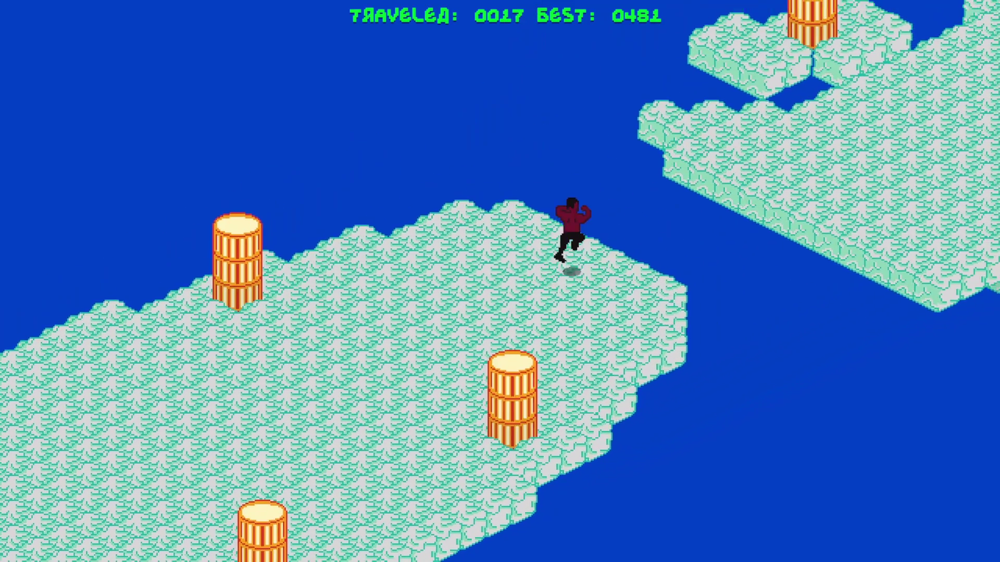

# Helljumper

### Made for Odin December Jam 2024

An isometric endless runner where you switch between heaven and hell.

Initially made in 48 hours for the [Odin Holiday Game Jam 2024](https://itch.io/jam/odin-holiday-jam), but it has since been updated.

The game's binaries can be found here: [Itch.io](https://x54321.itch.io/helljumper)

This game was written in Odin using the Raylib library. I used JSON files exported from Aseprite to specify the animations for the sprites,
and I used my own map editor [Total Editor 3](https://github.com/TheTophatDemon/Total-Editor-3) to design the level chunks in the game. That's
why there's a separate editor_assets folder, because it is for visualizing things in the 3D application instead of in the isometric view.
All of the assets are embedded into the application at compile time in the assets/assets.odin file.

